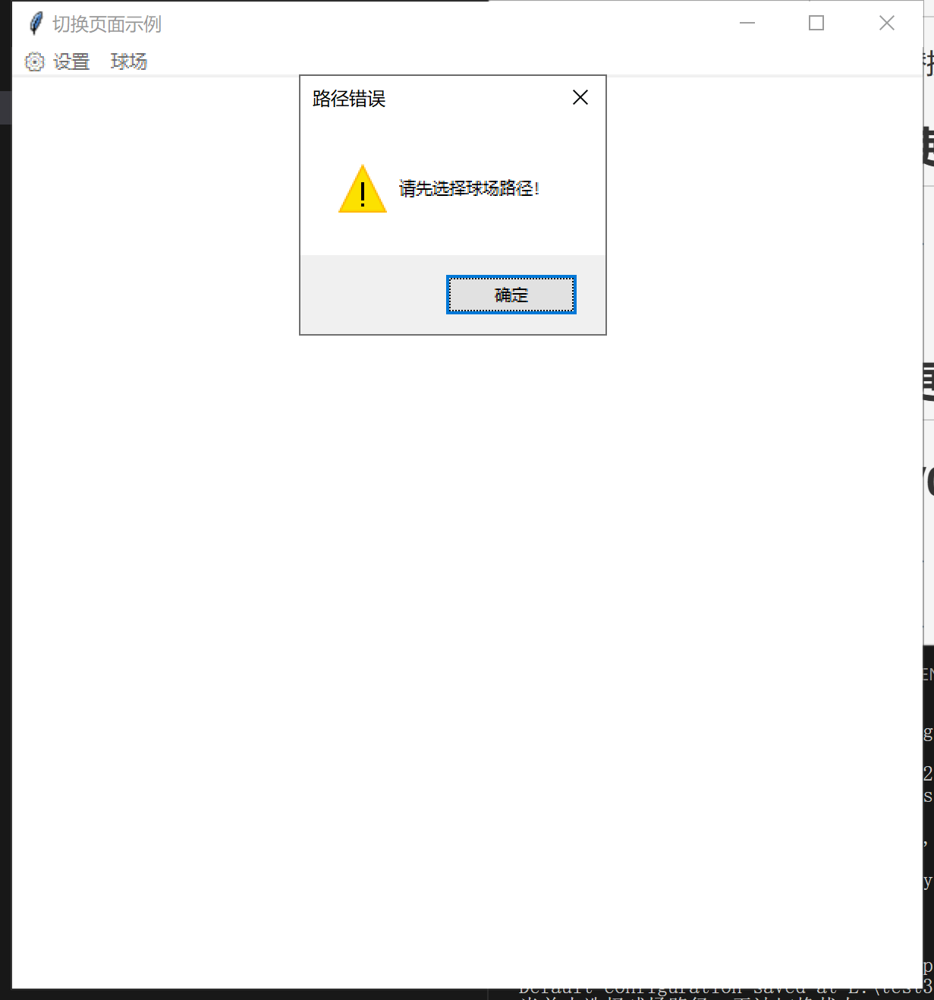
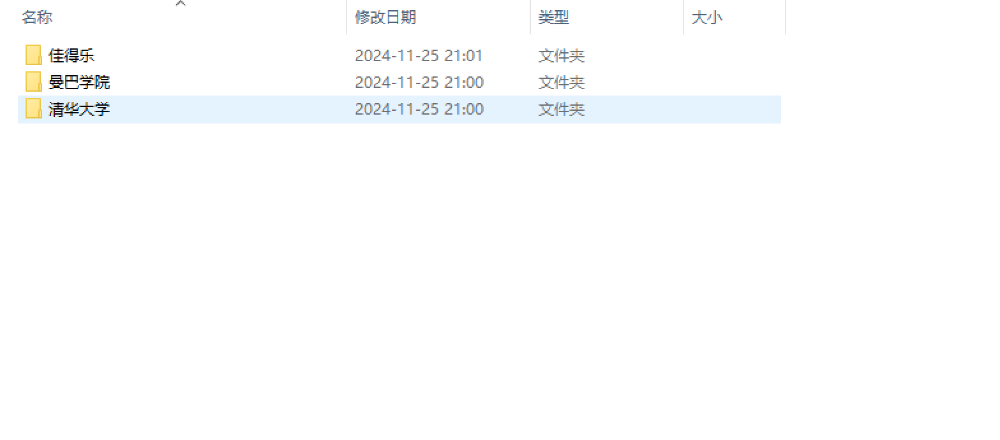
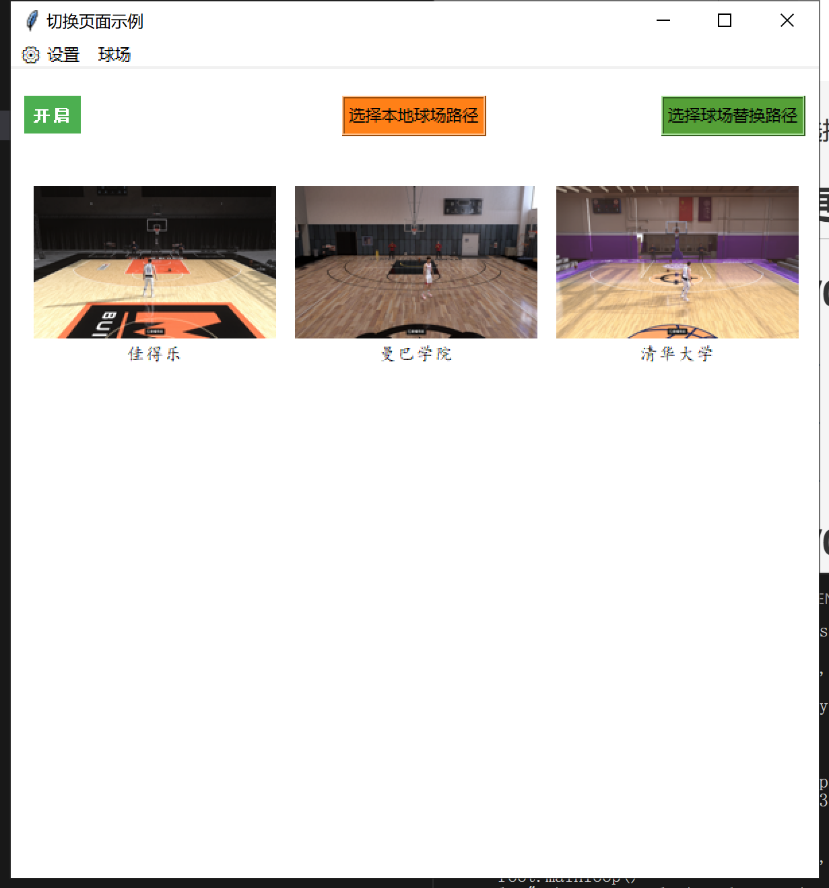
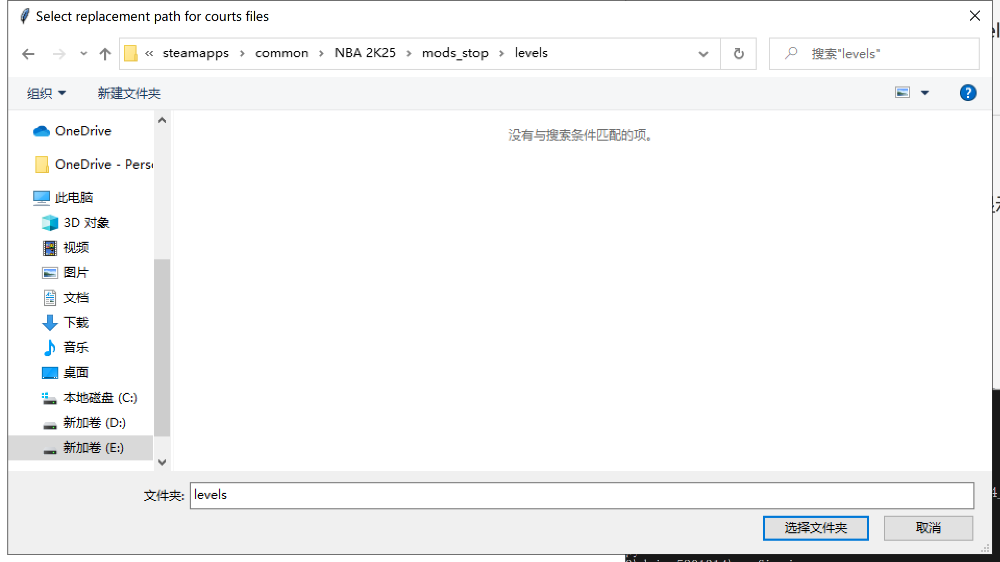
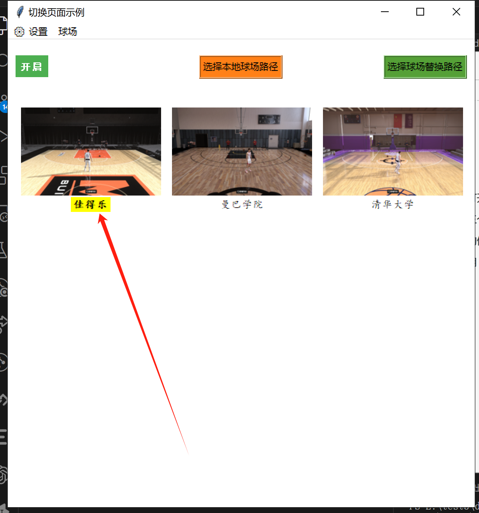
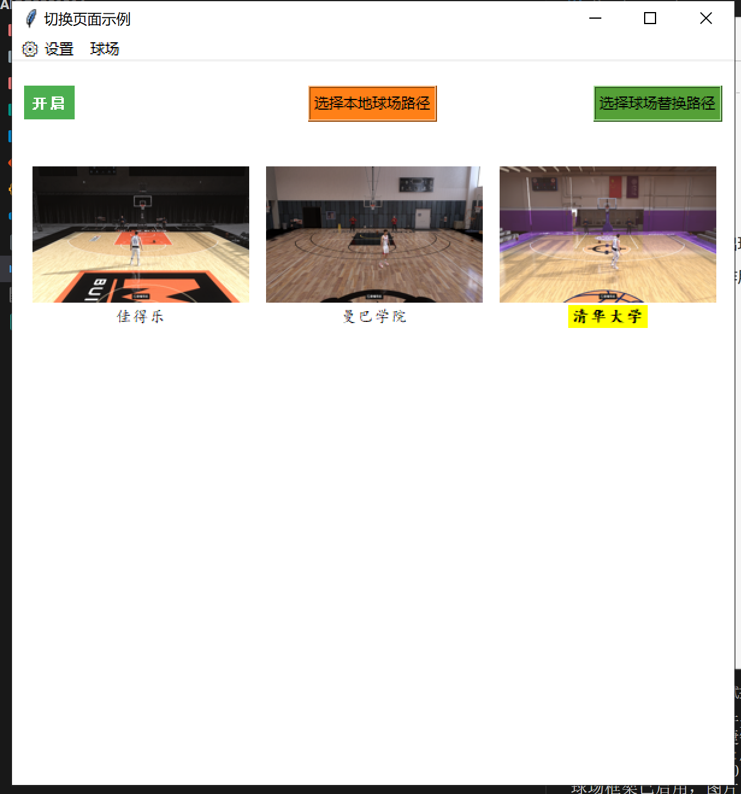

## 工具名称

球场替换工具 V0.5

## 简介

主要用于街头篮球场快速替换模型。

## 功能

替换掉levels/arena_blacktop_ext_floor.iff以及levels/arena_blacktop_ext.iff，通过工具来达到快速替换街球场目的，

注意事项:目前发现游戏在前台的时候，后台监听热键被占用无法使用，只能通过alt + tab把游戏先切到后台再使用（终结来说没有hook好用）

## 使用方法

### 1、第一次打开软件出现提示

提示"请先选择球场路径"，这是正常现象，后续选好球场路径后会保存记忆，后面就不会弹了。



### 2、主界面三个按钮作用

进入到主界面有三个按钮，第一次打开需要配置下，后面的配置会从config.json中读取。

* *开/关*：类似mods开关，决定是否加载levels文件夹

```
关的时候会修改mods/levels -> mods/levels_stop 达到让球场不加载的目的
开的时候会修改mods/levels_stop -> mods/levels 达到让球场加载的目的
```

* *选择本地球场路径*：选择你的球场资源路径，例如下方图片的样式分类存放



每个文件夹下存放需要替换的街球场和显示图片


选择完毕后就会加载球场图片到软件中



*选择球场替换路径*：选择你本地mods下的levels路径，例如E:\SteamLibrary\steamapps\common\NBA 2K25\mods\levels



### 3、快捷键的使用

可以通过快捷键达到快速切换球场的功能(设置界面暂时不要自定义，有bug)

```
切换窗口：alt + h
开关：alt + r
左移选择：-
右移选择：+
```

### 4、正式使用

点击任意一个球馆，标签变成黄色后说明替换的球场已经复制到了mods/levels/下面



这个时候在左上角会有弹窗提示（慢慢消失）


进游戏查看效果。

### 5、后续使用

第二次打开会记录前面选择的球场，无需重新选择路径，减少每次繁琐的操作。



若有不理解的地方，请致电开发者：DAIGG

## 更新日志

### V0.5

1、实装快捷键切换球场的操作，并在左上角显示

2、删除冗余代码，优化了代码结构

3、标签样式配置成“楷体”

### V0.4

1、修复了左上角标签显示字体为楷体，字号30

2、实装快捷键切换开关的操作，并在左上角显示

3、设置界面重新布局，能够保存快捷键（目前仍存在bug）

4、设置界面增加快捷键冲突判断，禁止保存同一快捷键

5、禁用一些打印日志，修改部分英文打印为中文显示

### V0.3

1、通过json保存路径和快捷键（本地和exe都支持）
2、settings增加左右切换、开关快捷键功能
3、解决焦点问题，可以正常切换到屏幕顶部

### V0.2

1、选择图片后，屏幕左上角会出现图片标签并慢慢消除
2、实现通过json保存一些匹配路径功能（目前只能支持本地，exe暂时不行）

### V0.1

1、重新布局UI界面，增加球场界面标签
2、添加全局快捷键alt+h,支持自定义快捷键
3、添加三组button，用来选择不同的路径
4、支持导入新的球场
5、有些闪退球场必须使用开关来进行跳过
