## **UPD!!!** **A demo of Manga Colorization v2.5 is now available [link](https://mangacol.com). Feel free to check it out!**


# Automatic colorization

1. Download [generator](https://drive.google.com/file/d/1qmxUEKADkEM4iYLp1fpPLLKnfZ6tcF-t/view?usp=sharing) and [denoiser](https://drive.google.com/file/d/161oyQcYpdkVdw8gKz_MA8RD-Wtg9XDp3/view?usp=sharing) weights. Put generator and extractor weights in `networks` and denoiser weights in `denoising/models`.
2. To colorize image or folder of images with CLI, use:
```
$ python inference.py -p "path to file or folder"
```

## Web UI (recommended)

A user-friendly interface is provided via Gradio:

```bash
$ pip install -r requirements.txt
$ python app.py
```

Then open: `http://127.0.0.1:7860`

UI features:
- Upload image and one-click colorization.
- Adjustable inference size (step=32).
- Optional denoising and denoiser sigma control.
- Optional GPU toggle.
- Result preview and PNG download.

| Original      | Colorization      |
|------------|-------------|
| 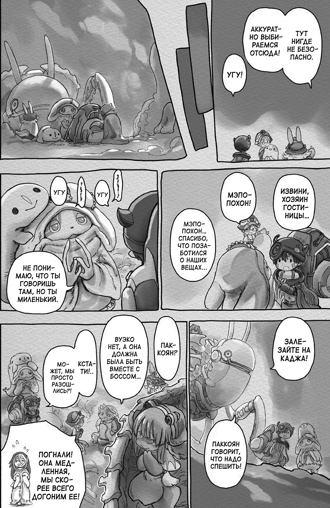 | 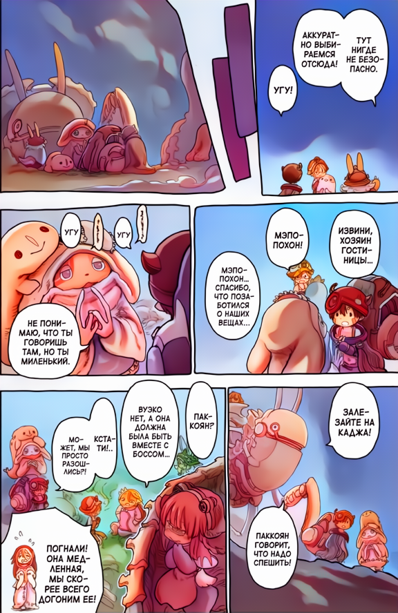 |
| 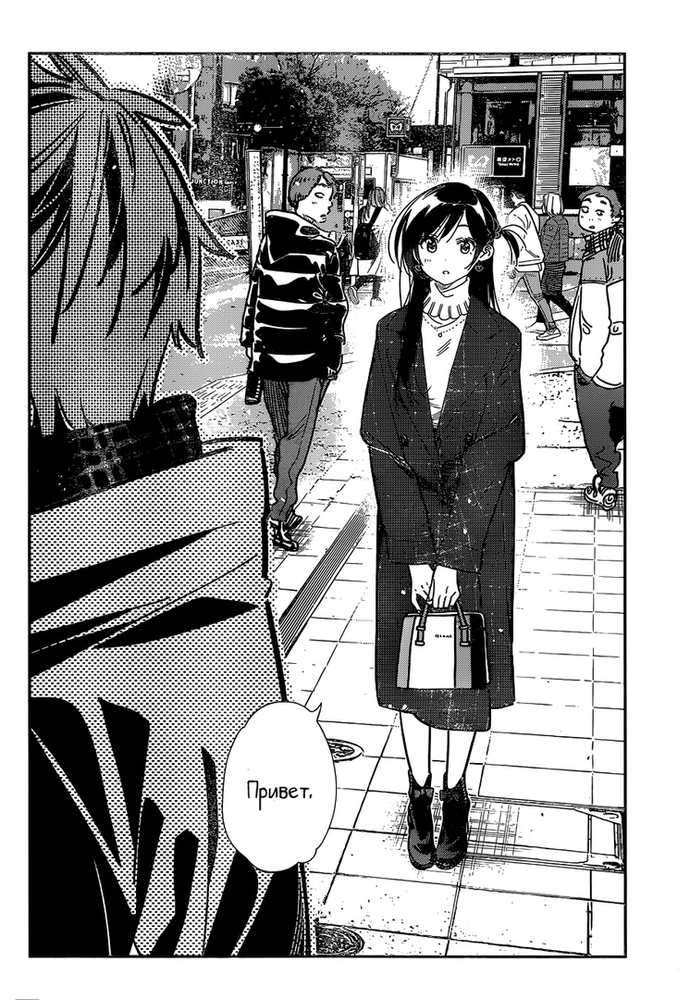 | 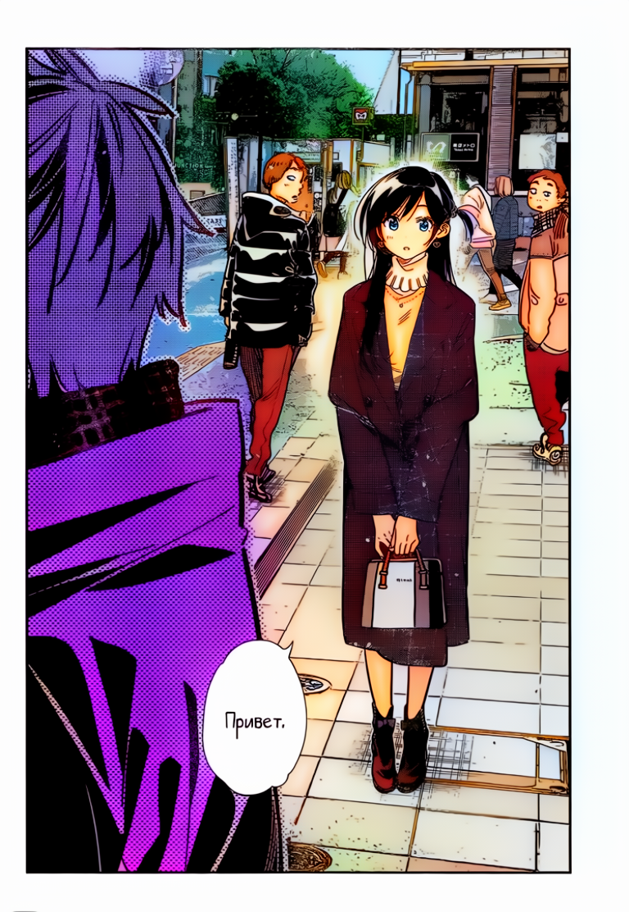 |
| 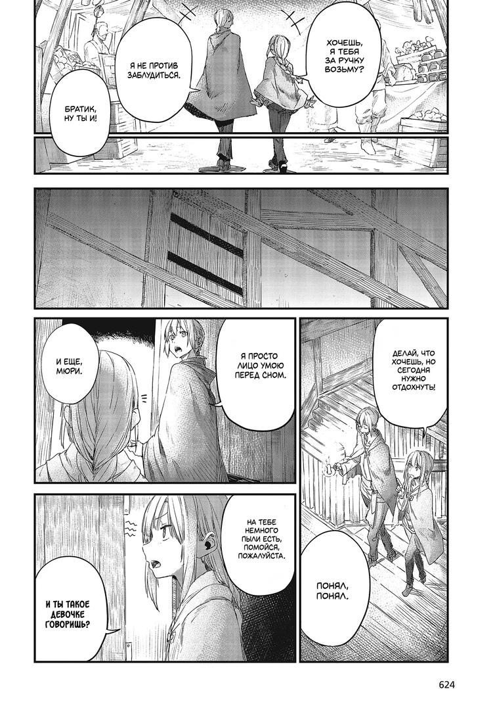 | 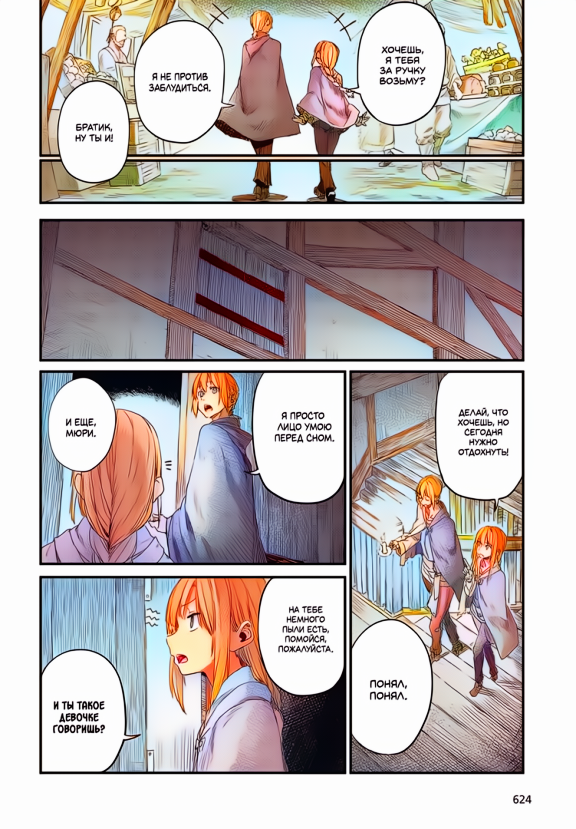 |
| 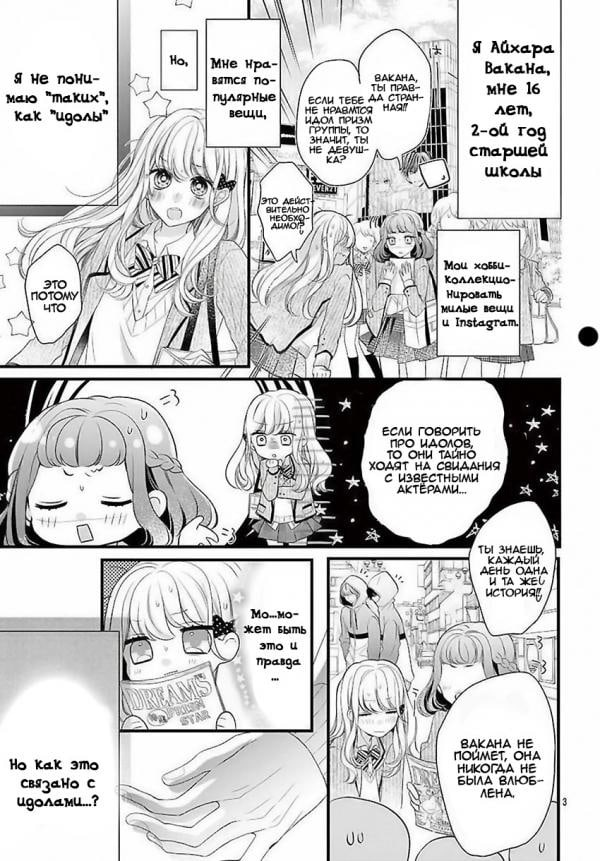 | 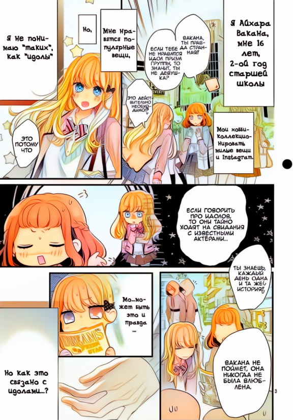 |
| 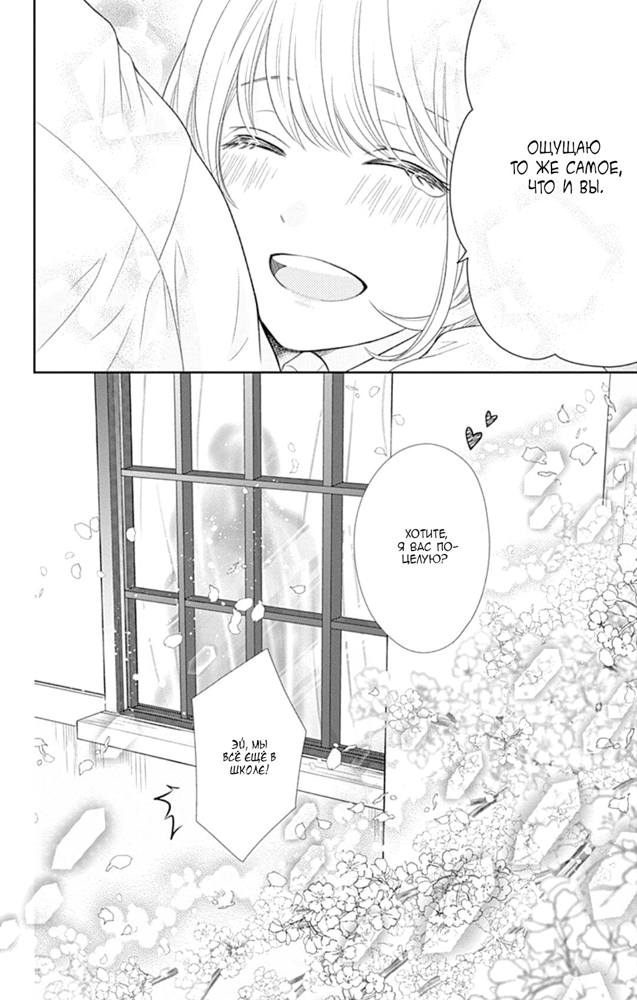 | 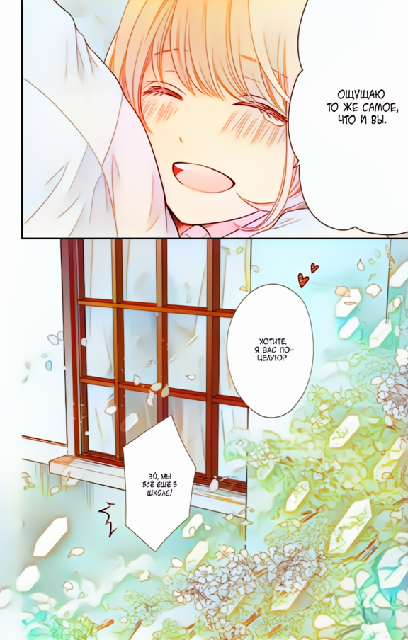 |
| 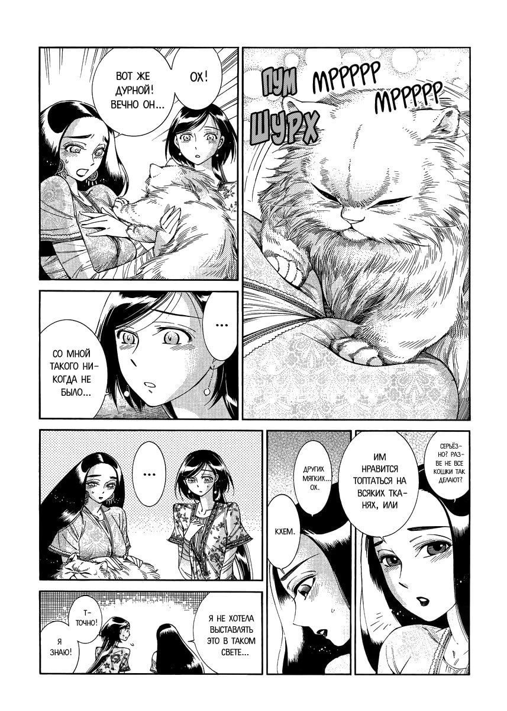 | 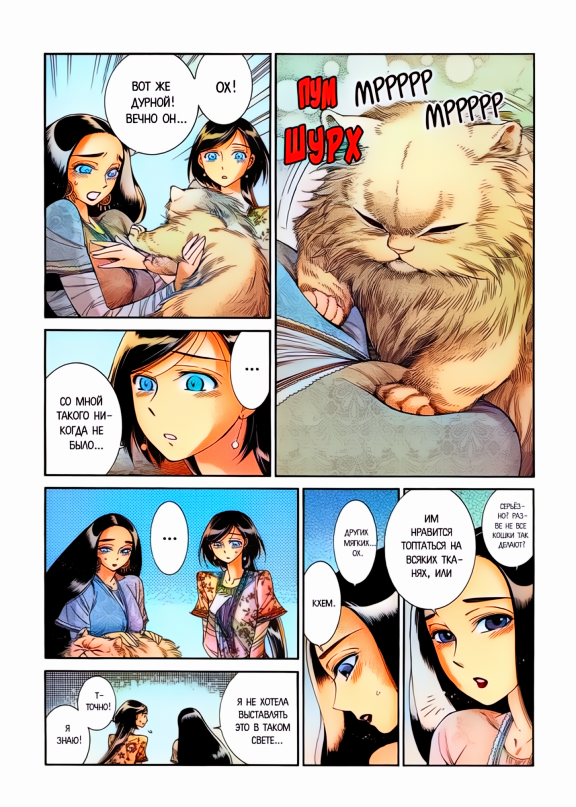 |
